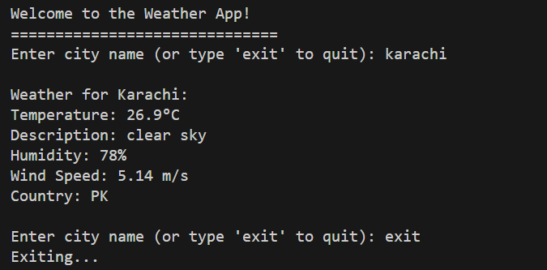

# Weather App

A command-line weather application that provides real-time weather information for any city using the OpenWeather API.

## Features

- Real-time weather data retrieval
- Temperature in Celsius
- Weather description
- Humidity levels
- Wind speed information
- Country identification
- Error handling for invalid city names

## Prerequisites

Before running the application, make sure you have:

- Python 3.6 or higher installed
- Required Python packages:
  - requests
  - python-dotenv
- OpenWeather API key

## Installation

1. Clone the repository:
```bash
git clone <repository-url>
cd weather-app
```

2. Install required packages:
```bash
pip install requests python-dotenv
```

3. Create a `.env` file in the root directory and add your OpenWeather API key:
```env
WEATHER_API_KEY=your_api_key_here
```

## Usage

1. Run the application:
```bash
python main.py
```

2. Enter a city name when prompted
3. View the weather information
4. Type 'exit' to quit the application

## Sample Output



## Weather Information Displayed

- City name
- Current temperature (°C)
- Weather description
- Humidity percentage
- Wind speed (m/s)
- Country code

## Error Handling

The application handles various error cases:
- Invalid city names
- Network connection issues
- API response errors

## Contributing

Contributions, issues, and feature requests are welcome. Feel free to check issues page if you want to contribute.

## License

This project is licensed under the MIT License - see the LICENSE file for details.

## Acknowledgments

- OpenWeather API for providing weather data
- Contributors to the python-dotenv package
- Requests library maintainers