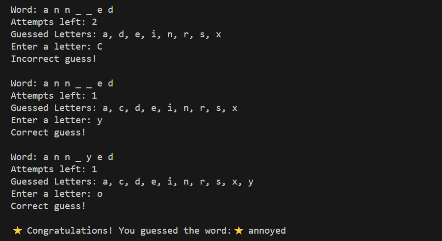
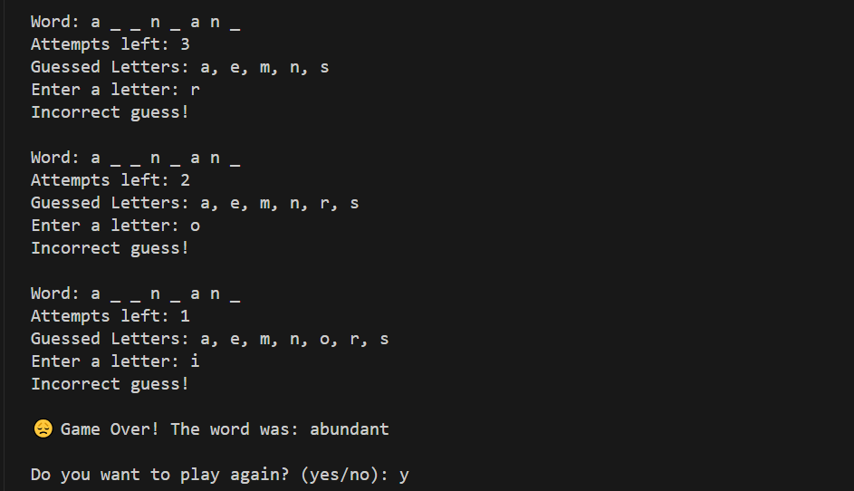

# Hangman Game 🎮

A classic word guessing game implemented in Python where players try to guess a word one letter at a time.

## 🎯 Features

- Random word selection from a predefined word list
- Visual feedback for correct and incorrect guesses
- Track of guessed letters
- 6 attempts to guess the word correctly
- Option to replay the game
- User-friendly interface with emoji feedback

## 📋 Game Rules

1. The game randomly selects a word from the word list
2. Player gets 6 attempts to guess the word correctly
3. For each guess:
   - If correct: Letter is revealed in the word
   - If incorrect: Player loses one attempt
4. Player wins if they guess the word before running out of attempts

## 🎲 Game States

### Winning State

*Player successfully guesses the word*

### Game Over State

*Player runs out of attempts*

## 🎮 How to Play

1. Run the game:
```bash
python main.py
```

2. The game will display:
   - Welcome message
   - Current state of the word (with underscores for unguessed letters)
   - Number of attempts remaining
   - Letters already guessed

3. Enter one letter at a time when prompted

4. After each game:
   - Enter 'yes' or 'y' to play again
   - Enter 'no' or 'n' to exit

## 🔧 Code Structure

### Files
- `main.py`: Contains the main game logic
- `word_list.py`: Contains the list of words for the game

### Functions
- `load_word()`: Loads words from file
- `play_hangman()`: Main game logic
- `main()`: Game loop and replay functionality

## ⚙️ Requirements

- Python 3.x
- No additional packages required

## 🚀 Future Improvements

- [ ] Add difficulty levels
- [ ] Include word categories
- [ ] Add ASCII art for hangman stages
- [ ] Implement score tracking
- [ ] Add multiplayer functionality

## 🤝 Contributing

Feel free to fork this project and submit pull requests for any improvements!

## 📝 License

This project is open source and available under the MIT License.

---