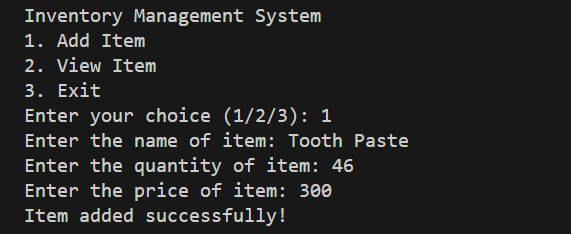
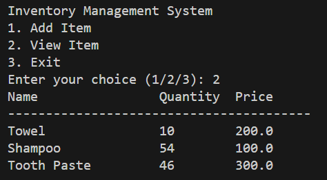
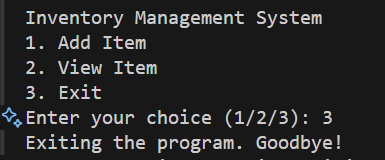

# Inventory Management System

A simple command-line inventory management system built with Python that allows users to add and view inventory items. The system stores data in a CSV file for persistent storage.

## Features

- Add new items with name, quantity, and price
- View all items in a formatted table
- Data persistence using CSV file storage
- Simple command-line interface

## Requirements

- Python 3.x
- No additional packages required (uses built-in modules only)

## Installation

1. Clone this repository or download the source code
2. Navigate to the project directory
3. Run the program using Python:
   ```bash
   python main.py
   ```

## Usage

The system provides three main options:

### 1. Add Item
Users can add new items to the inventory by providing:
- Item name
- Quantity
- Price


*Figure 1: Adding a new item to inventory*

### 2. View Items
Displays all items in the inventory in a formatted table showing:
- Name
- Quantity
- Price


*Figure 2: Viewing all inventory items*

### 3. Exit
Closes the program


*Figure 3: Exiting the application*

## File Structure

```
inventory-management-system/
├── main.py           # Main program file
├── inventory.csv     # Data storage file (created automatically)
└── README.md        # Documentation
```

## How It Works

1. The program uses a CSV file (`inventory.csv`) to store the inventory data
2. New items are appended to the CSV file when added
3. When viewing items, the program reads and displays all entries from the CSV file
4. The system handles basic error cases like file not found

## Code Structure

- `add_item()`: Handles the addition of new items to the inventory
- `view_item()`: Displays all items in a formatted table
- `main()`: Contains the main program loop and menu system

## Error Handling

The system includes basic error handling for:
- File not found errors when reading inventory
- Invalid menu choices
- Input validation for quantity and price

## Future Improvements

- Add item deletion functionality
- Implement item updating
- Add search functionality
- Include data validation
- Add categories for items
- Implement stock alerts

## Contributing

Feel free to fork this repository and submit pull requests. All contributions are welcome!

## License

This project is open source and available under the [MIT License](LICENSE).
