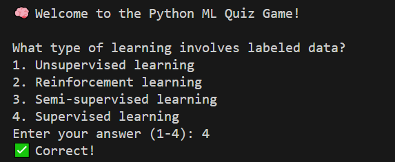
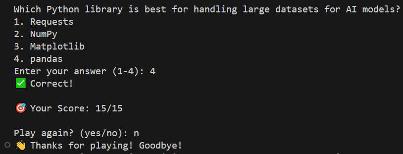
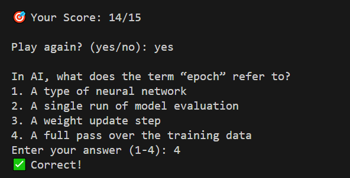

# Python ML Quiz Game 🧠

A robust, interactive command-line quiz application designed to test knowledge through multiple-choice questions. This application demonstrates Python best practices in file handling, error management, and user interaction.

## Features ✨

### Core Features
- **Dynamic Question Loading**
  - Flexible file-based question management
  - Support for unlimited questions
  - UTF-8 encoding for international character support

### User Interface
- **Interactive Command-Line Interface**
  - Clear question presentation
  - Numbered options (1-4)
  - Color-coded feedback (where supported)
  - Emoji-based status indicators

### Game Mechanics
- **Question Management**
  - Random question ordering
  - Multiple choice format (4 options)
  - Case-insensitive answer validation
  - Immediate feedback system

### Game Flow
- **Session Management**
  - Score tracking and reporting
  - Replay functionality
  - Graceful exit handling
  - Progress tracking

## Technical Requirements 📋

### System Requirements
- Python 3.6 or higher
- Operating System: Windows/Linux/MacOS
- Minimum 512MB RAM
- 10MB free disk space

### Python Dependencies
```requirements.txt
random (built-in)
```

### Optional Requirements
- Terminal with UTF-8 support for emoji display
- Color-capable terminal for enhanced output

## Application Screenshots 📸

### Quiz Start

*Welcome message and game initialization*

### Question Display

*Game ending*

### Correct Answer Feedback

*Score counting*

## Installation 🔧

### Standard Installation
```bash
# Clone the repository
git clone (this repo link)

# Navigate to project directory
cd 6_Creating Quiz Game

# Verify Python installation
python --version
```

### Development Installation
```bash
# Create virtual environment
python -m venv venv

# Activate virtual environment
# Windows
venv\Scripts\activate
# Unix/MacOS
source venv/bin/activate
```

## Project Structure 📁

│
├── main.py # Main program file
├── quiz.txt # Question database file
├── Screenshots/ # Output screenshots
└── Images # Output picture

### Quiz File Configuration
The `quiz.txt` file must follow this specific format:
```
question|option1|option2|option3|option4|correct_answer
```

Example quiz.txt:
```
What is Python's primary use?|Web Development|Data Science|Game Development|All of the above|All of the above
Which symbol is used for comments in Python?|//|#|/*|<!----|#
What is the output of 2**3?|6|8|9|16|8
```

### Environment Variables (Optional)
```bash
QUIZ_FILE_PATH=custom/path/to/quiz.txt
DEBUG_MODE=True
```

## Detailed Usage Guide 📖

### Basic Usage
1. **Starting the Game**
   ```bash
   python main.py
   ```

2. **During Gameplay**
   - Read the question displayed
   - Choose answer (1-4)
   - View feedback
   - See running score
   - Choose to continue or exit

### Advanced Usage
```python
# Import as module
from main import play_quiz

# Custom implementation
play_quiz(custom_quiz_file="my_questions.txt")
```

## Code Architecture 🏗️

### Core Components
1. **Question Loader (`load_quiz_data`)**
   - File handling
   - Data parsing
   - Error checking
   - Question validation


## Contributing 🤝

To contribute to this project:
1. Fork the repository
2. Create a new branch
3. Make your changes
4. Submit a pull request

## License 📄

This project is open source and available under the MIT License.

## Acknowledgments 🌟

---

