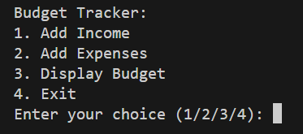
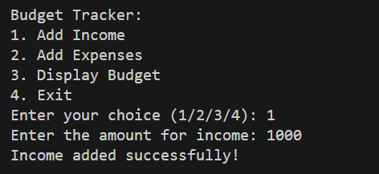
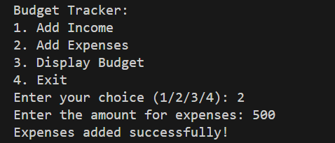
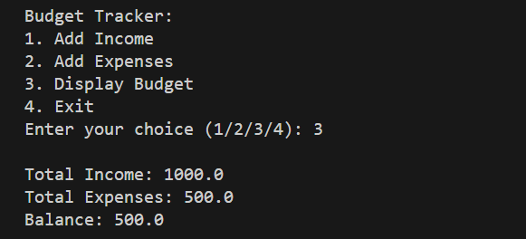
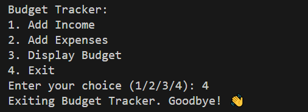

# 💰 Budget Tracker CLI

A simple Python command-line application to track your income and expenses. This tool allows you to add income, record expenses, and view a summary of your financial balance — all stored in a local JSON file for persistence.

---

## 🚀 Features

- Add income entries  
- Add expense entries  
- View a budget summary (income, expenses, balance)  
- Data is stored locally in a `budget.json` file  
- Clean and beginner-friendly code  

---

## 🖥️ Screenshots

### ▶️ Start of the App


### ➕ Add Income


### ➖ Add Expense


### 📊 Display Budget Summary


### ❌ Exit the Application


> 💡 **Note:** Place your screenshots inside a `Images/` folder in the root directory.

---

## 📂 Project Structure
```bash
|── Images folder # Contains screenshots  
├── budget.json # Stores your budget data 
├── main.py # Main Python script 
└── README.md # Project documentation
```


---

## 🛠️ Getting Started

### Prerequisites

- Python 3.x installed on your system

### How to Run

1. Clone this repository or download the `main.py` file.
2. Open a terminal and navigate to the directory.
3. Run the application with:

```bash
python main.py
```

## 🧑‍💻 Author

**Created with ❤️ using Python.**