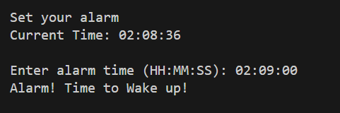

# ⏰ Python Alarm Clock

A simple command-line Python alarm clock that plays a sound when the current time matches the alarm time. Uses the `playsound` module to trigger an audio alert, and is lightweight, beginner-friendly, and runs from your terminal.

---

## 🧩 Features

- Set an alarm in `HH:MM:SS` format  
- Constantly checks the system time  
- Plays a `.wav` sound when the alarm triggers  
- Built using `datetime`, `time`, and `playsound`  
- Cross-platform compatible (Windows, macOS, Linux)

---

## 📦 Project Structure
```bash
  alarm_clock/
  ├── Assets/
  │   └── alarm.wav        # Alarm sound file
  |   └── Output.png       # Optional screenshot file
  ├── main.py              # Main script
  ├── pyproject.toml       # Project metadata and dependencies (managed by uv)
  ├── README.md            # This file
  └── screenshots/         # Optional screenshot folder
```
 
---

## 🚀 Getting Started

### 🛠 Requirements

- Python 3.7 or later
- [`uv`](https://github.com/astral-sh/uv) (fast Python package and environment manager)

### ⚙️ Setup Instructions

1. **Create a virtual environment and install dependencies**  
   Open a terminal in your project folder and run:

```bash
   uv install playsound
```

- To activate environmental, write

```bash
.venv\Scripts\activate
```
---

## **📸 Screenshots**



---

## **🧑‍💻 Author**

Made with 🐍 and ☕ by [Osama bin Adnan]
Contributions welcome! Want to add snooze, multiple alarms, or a GUI? Fork it and send a PR!
