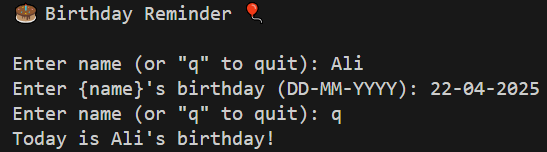

# Birthday Reminder

This project is a simple Python program that helps you store and check birthdays. It allows users to input names and their corresponding birthdays, and it checks if today is someone's birthday.

## Features

- **Store Birthdays**: Input names and their birthdays in the format `DD-MM-YYYY`.
- **Check Birthdays**: Automatically checks if today's date matches any stored birthdays and notifies you.

## How to Use

1. Run the program by executing the `main.py` file.
2. Enter names and their birthdays when prompted.
3. Type `q` to quit the input process.
4. The program will check if today is someone's birthday and display a message accordingly.

## Requirements

- Python 3.x

## Example Output



## Code Overview

### `store_birthdays()`
This function allows users to input names and their birthdays. It stores the data in a dictionary and returns it.

### `check_birthdays(birthdays)`
This function checks if today's date matches any stored birthdays and prints a message if a match is found.

### `main()`
The main function orchestrates the program by calling `store_birthdays()` and `check_birthdays()`.

## File Structure

```
main.py
Images/
    Output.png
```

## Notes

- Ensure the date format is `DD-MM-YYYY` when entering birthdays.
- The program uses the system's current date to check for birthdays.