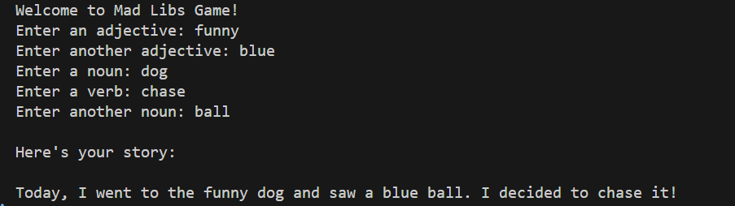

# Mad Libs Game

A simple and fun implementation of the classic Mad Libs word game in Python. This program asks players to input different types of words (adjectives, nouns, and verbs) and then incorporates these words into a pre-written story template, often creating humorous results.

## Features

- Interactive command-line interface
- Collects various parts of speech from the user
- Generates a unique story based on user input
- Simple and easy to understand code structure

## How to Play

1. Run the program using Python 3:
   ```bash
   python main.py
   ```
2. Follow the prompts to enter:
   - Two adjectives
   - Two nouns
   - One verb

3. The program will generate a funny story using your words!

## Example Output

Here's an example of what the game looks like when played:



## Requirements

- Python 3.x

## Project Structure

```
├── main.py          # Main game script
├── Images/          # Contains screenshot of game output
│   └── Output.png
└── README.md        # Project documentation
```

## How It Works

The program follows these steps:
1. Displays a welcome message
2. Prompts the user for different types of words
3. Takes the user input and inserts it into a story template
4. Displays the completed story

## Contributing

Feel free to fork this project and make your own modifications. You can:
- Add more story templates
- Include different types of words
- Enhance the user interface
- Add error handling for input validation