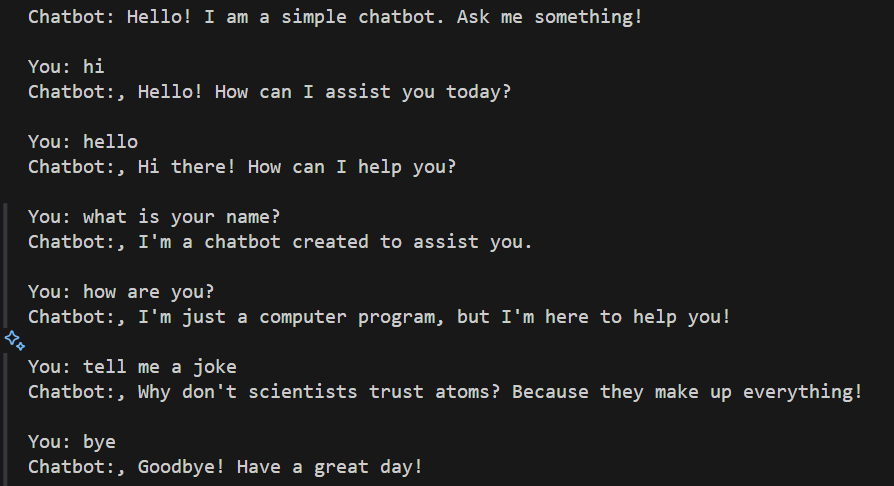

# Simple Chatbot

A basic command-line chatbot implemented in Python that can engage in simple conversations with users through predefined responses.

## Features

- Easy-to-use command-line interface
- Case-insensitive input matching
- Predefined responses for common queries
- Graceful exit functionality
- Default response for unrecognized inputs

## How It Works

The chatbot uses a dictionary-based approach where:
- User inputs are matched against predefined keys
- Responses are returned based on the matched input
- All inputs are converted to lowercase for consistent matching
- The chat continues until the user says "bye"

## Available Commands

The chatbot recognizes the following inputs:
- "hi" or "hello" - Greeting responses
- "how are you?" - Status response
- "what is your name?" - Bot introduction
- "tell me a joke" - Tells a simple joke
- "bye" - Exits the chat

## Output Example

Below is an example of how the chatbot interaction looks:



## How to Run

1. Make sure you have Python installed on your system
2. Navigate to the project directory
3. Run the following command:
```bash
python main.py
```

## Future Improvements

- Add more responses and conversation topics
- Implement natural language processing
- Add memory of conversation context
- Include more interactive features

## Requirements

- Python 3.x
- No additional packages required