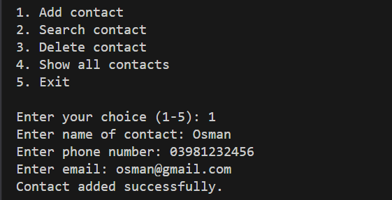
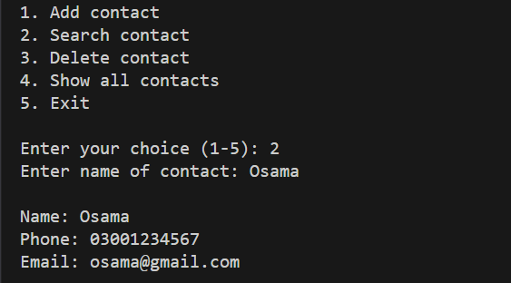
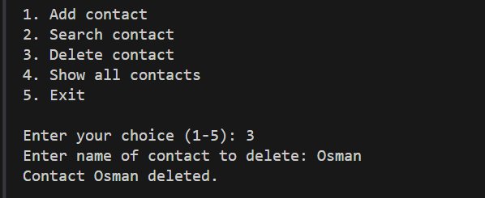
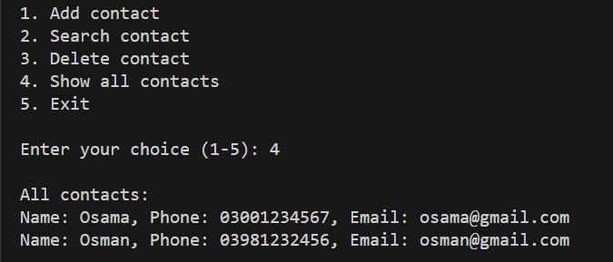
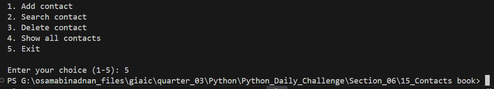

# Contact Book Application

A command-line contact management system built with Python that allows users to store and manage contact information including names, phone numbers, and email addresses.

## Features

- Add new contacts with validation
- Search for existing contacts
- Delete contacts
- View all stored contacts
- Persistent storage in text file
- Input validation for phone numbers and email addresses

## Screenshots

### Adding a Contact

*Adding a new contact with name, phone, and email*

### Searching for a Contact

*Searching for an existing contact by name*

### Deleting a Contact

*Removing a contact from the address book*

### Showing All Contacts

*Displaying all stored contacts*

### Exit Application

*Exiting the application*

## Technical Details

### Requirements
- Python 3.6+
- No external dependencies required

### Installation
1. Clone or download this repository
2. Navigate to the project directory
3. Run the application using Python:
```bash
python main.py
```

### Data Storage
Contacts are stored in a `contacts.txt` file in the following format:
```
name,phone_number,email_address
```

### Input Validation
- Phone numbers must be 9-15 digits (optional '+' and country code allowed)
- Email addresses must follow standard format (username@domain.tld)
- Duplicate contact names are not allowed

## Code Structure

- `main.py`: Main application file containing the ContactBook class and program logic
- `contacts.txt`: Storage file for contact information
- `Images/`: Directory containing application screenshots

## Usage

1. Start the application
2. Choose from the following options:
   - 1: Add a new contact
   - 2: Search for a contact
   - 3: Delete a contact
   - 4: Show all contacts
   - 5: Exit the application
3. Follow the prompts to perform your desired action

## Error Handling

The application includes comprehensive error handling for:
- File operations
- Invalid input validation
- Duplicate contacts
- Contact not found scenarios