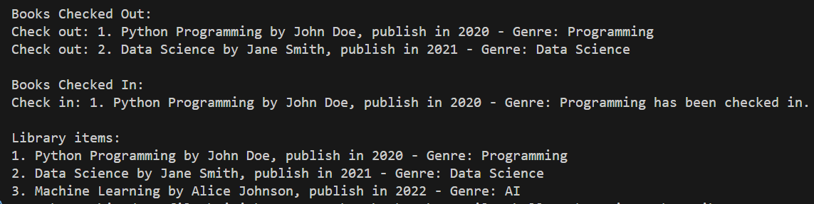

# Library Management System

A simple Python-based Library Management System that demonstrates Object-Oriented Programming concepts.

## Features

- Book management with title, author, publication year, and genre
- User management system
- Check-out and check-in functionality
- Availability tracking for library items
- Object inheritance demonstration with `LibraryItems` as base class

## Classes

### LibraryItems (Base Class)
- Basic properties for all library items
- Handles check-in and check-out functionality
- Tracks item availability

### Book (Derived Class)
- Inherits from LibraryItems
- Adds genre-specific functionality
- Custom string representation

### User
- Manages user interactions
- Handles borrowing and returning of items

## Sample Output

Below is a screenshot showing the program in action:



## Usage

Run the program using Python 3:

```bash
python main.py
```

The program will demonstrate:
1. Creating library items
2. Adding books to the library
3. User borrowing books
4. User returning books
5. Displaying library inventory

## Technical Details

- Language: Python 3
- Programming Paradigm: Object-Oriented Programming
- Key Concepts: Inheritance, Encapsulation, Method Overriding