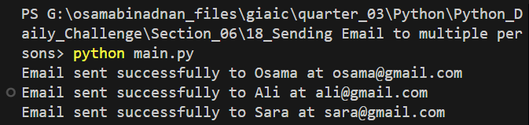

# Automated Student Evaluation Email System

This Python script automates the process of sending evaluation results to multiple students via email. It reads student data from a CSV file and sends personalized emails containing their evaluation scores.

## Features

- Reads student information (name, email, score) from a CSV file
- Sends personalized emails using Gmail's SMTP server
- Secure email transmission using SSL encryption
- Error handling for various scenarios
- Progress tracking with console output

## Prerequisites

- Python 3.x
- Gmail account with App Password (if 2FA is enabled)
- uv package manager (for dependency management)
- CSV file with student data

## Project Structure

```
├── main.py           # Main Python script
├── pyproject.toml    # Project dependencies and metadata
├── uv.lock           # Lock file for uv package manager
├── Students.csv      # CSV file containing student data
├── README.md         # Project documentation
└── Images/
    └── Output.png    # Screenshot of script execution
```

## Dependencies

This project uses `uv` as the package manager. Dependencies are specified in `pyproject.toml`.

Required packages:
- smtplib (standard library)
- ssl (standard library)
- csv (standard library)
- datetime (standard library)

## Setup Instructions

1. Clone or download this repository

2. Install uv if you haven't already:
   ```bash
   pip install uv
   ```

3. Install project dependencies using uv:
   ```bash
   uv pip install
   ```

4. Update the `from_address` and `password` variables in `main.py` with your Gmail credentials
   - If using 2FA, generate an App Password from your Google Account settings

5. Prepare your `Students.csv` file with student data

6. Run the script:
   ```bash
   python main.py
   ```

## CSV File Format

The `Students.csv` file should contain the following columns:
- Name
- Email
- Score

Example:
```csv
Name,Email,Score
John Doe,john@example.com,85
Jane Smith,jane@example.com,92
```

## Output Example



## Security Note

- Never commit your email password or App Password to version control
- Consider using environment variables or a configuration file for credentials
- Use App Passwords instead of your main account password when 2FA is enabled

## Error Handling

The script handles various error scenarios:
- Authentication failures
- Missing or malformed CSV file
- Network connection issues
- Invalid email addresses
- Malformed data rows

## Contributing

Feel free to submit issues and enhancement requests.

## License

This project is open source and available under the [MIT License](LICENSE).