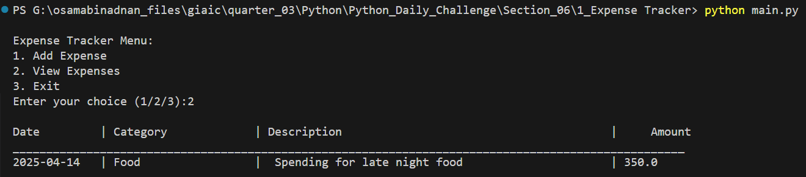

# Expense Tracker Application

A simple command-line expense tracking application built in Python that helps users manage and track their daily expenses.

## Features

### 1. Add Expense
Users can add new expenses with the following details:
- Date (YYYY-MM-DD format)
- Category (Food, Travel, Groceries, etc.)
- Description
- Amount


### 2. View Expenses
Display all recorded expenses in a formatted table showing:
- Date
- Category
- Description
- Amount



### 3. Exit Application
Safely exit the application when done


## Technical Details

- Written in Python 3
- Uses CSV file for data persistence
- Data stored in `expense_data.csv`
- Implements error handling for invalid inputs
- Uses formatted string literals for clean data display

## How to Run

1. Ensure Python 3 is installed on your system
2. Clone this repository
3. Navigate to the project directory
4. Run the application:
```bash
python main.py
```

## File Structure
```
expense_data.csv - Data storage file
main.py         - Main application code
Images/         - Application screenshots
  ├── Add_Expense.png
  ├── View_Expenses.png
  └── Exit_App.png
```

## Usage Instructions

1. **Adding an Expense**
   - Select option 1 from main menu
   - Enter date in YYYY-MM-DD format
   - Choose a category
   - Add a description
   - Enter the amount

2. **Viewing Expenses**
   - Select option 2 from main menu
   - View all recorded expenses in tabular format

3. **Exiting the Application**
   - Select option 3 to safely exit

## Error Handling

The application includes error handling for:
- Invalid amount inputs
- File not found scenarios
- Invalid menu choices