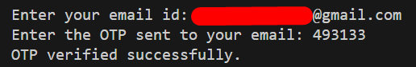

# OTP Verification System

A simple Python application that generates and verifies One-Time Passwords (OTP) through email.

## Features

- Generates random 6-digit OTP
- Sends OTP via email using Gmail SMTP
- Secure authentication using environment variables
- OTP verification functionality

## Requirements

- Python 3.x
- `python-dotenv` package
- Gmail account with App Password enabled

## Setup

1. Create a `.env` file in the project root with the following content:
   ```
   GMAIL_ID=your_email@gmail.com
   GOOGLE_APP_ID=your_app_password
   ```

2. Install required packages:
   ```
   pip install python-dotenv
   ```

## Usage

1. Run the script:
   ```
   python main.py
   ```
2. Enter the recipient's email address when prompted
3. Check the email for OTP
4. Enter the received OTP to verify

## Output Example

Below is an example of the program execution:



## Security Notes

- Uses TLS for secure email transmission
- Credentials are stored in environment variables
- Gmail App Password is required (not regular password)

## Environment Variables

- `GMAIL_ID`: Your Gmail address
- `GOOGLE_APP_PWD`: Your Gmail App Password

## How to Get Gmail App Password

1. Go to your Google Account settings
2. Navigate to Security
3. Enable 2-Step Verification
4. Generate App Password under 'App Passwords'