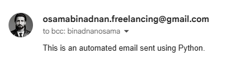

# Email Scheduler

A Python script that automatically sends scheduled emails using Gmail's SMTP server. This project demonstrates how to create an automated email scheduling system with environment variable management for secure credential handling.

## Features

- Automated email sending at specified intervals
- Secure credential management using environment variables
- Gmail SMTP integration
- Configurable email content and scheduling

## Requirements

- Python 3.x
- Required packages:
  - `python-dotenv`
  - `schedule`

Install dependencies using:
```bash
pip install python-dotenv schedule
```

## Setup

1. Create a `.env` file in the project root with the following variables:
```
SENDER_EMAIL=your.email@gmail.com
APP_PASSWORD=your-app-specific-password
RECEIVER_EMAIL=recipient@email.com
```

2. Generate an App Password for Gmail:
   - Go to your Google Account settings
   - Navigate to Security
   - Enable 2-Step Verification if not already enabled
   - Create an App Password for your application
   - Copy the generated password to your `.env` file

## Usage

Run the script using:
```bash
python main.py
```

The script will:
- Load environment variables
- Connect to Gmail's SMTP server
- Send an email every minute to the specified recipient
- Print confirmation messages for successful email delivery

## Output

Here's an example of the script running successfully:



## Code Structure

The main components of the script are:
- Environment variable loading using `python-dotenv`
- Email sending function using `smtplib`
- Task scheduling using the `schedule` library
- Continuous execution loop for running scheduled tasks

## Security Notes

- Never commit your `.env` file to version control
- Use App Passwords instead of your main Gmail password
- Keep your credentials secure and private

## Contributing

Feel free to fork this repository and submit pull requests for any improvements.