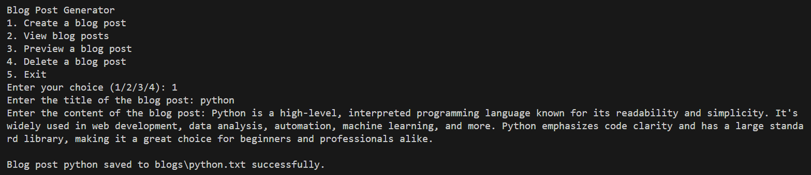
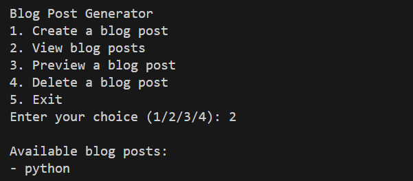
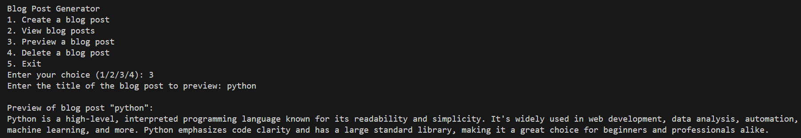
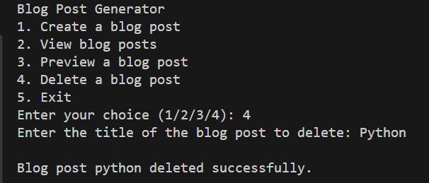
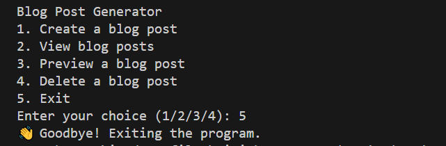

# Blog Post Generator

A simple command-line application for managing blog posts with basic CRUD operations (Create, Read, Update, Delete).

## Features

- Create and save blog posts
- View list of all blog posts
- Preview content of specific blog posts
- Delete existing blog posts

## Directory Structure

```
Blog Post Generator/
│
├── main.py         # Main program file
├── Blogs/          # Directory where blog posts are stored
└── Images/         # Output screenshots
```

## Usage

1. Run the program:
```bash
python main.py
```

2. Choose from the following options:
   - 1: Create a new blog post
   - 2: View all blog posts
   - 3: Preview a specific blog post
   - 4: Delete a blog post
   - 5: Exit the program

## Example Operations

### Creating a Blog Post
1. Select option 1
2. Enter the title for your blog post
3. Enter the content
4. The post will be saved as a .txt file in the Blogs directory


*Creating a new blog post*

### Viewing Blog Posts
1. Select option 2
2. See a list of all available blog posts


*Viewing list of available blog posts*

### Previewing a Blog Post
1. Select option 3
2. Enter the title of the blog post you want to preview
3. The content will be displayed in the console


*Previewing content of a specific blog post*

### Deleting a Blog Post
1. Select option 4
2. Enter the title of the blog post to delete
3. The file will be removed from the Blogs directory


*Deleting an existing blog post*

### Exiting the Program
Select option 5 to safely exit the program


*Exiting the program*

## Technical Details

- Written in Python 3
- Uses built-in `os` module for file operations
- Stores blog posts as .txt files
- Implements error handling for file operations
- Case-insensitive file handling

## Error Handling

- Handles non-existent blog posts
- Creates Blogs directory if it doesn't exist
- Validates user input for menu choices
- Provides feedback for all operations

## License

This project is open source and available under the MIT License.