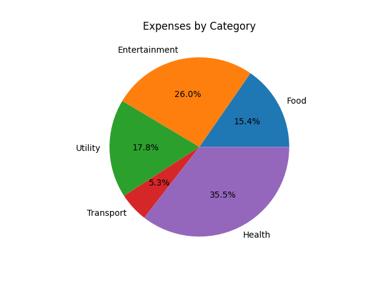

# 📊 Expense Visualizer

This Python script reads your expense data from a CSV file and generates a pie chart that shows how much you've spent in each category.

---

## 📁 File: `expenses.csv`

Your CSV file must follow this format (including headers):


``` csv
Date,Category,Description,Amount 
2025-04-01,Food,Coffee,3.5 
2025-04-02,Transport,Bus Ticket,2.75 
2025-04-03,Food,Lunch,12.0 
2025-04-04,Utilities,Electricity Bill,45.0
```


---

## ▶️ How to Run

1. **Install dependencies using `uv`:**

    ```bash
    uv pip install matplotlib
    ```

2. **Run the script:**

    ```bash
    python main.py
    ```

- If `expenses.csv` exists in the same directory, a pie chart will be displayed showing expenses by category.
- If the file is missing, the script will print:

    ```
    No expenses found.
    ```

---

## 📦 Requirements

- Python 3.6 or newer
- `matplotlib` (installed via `uv`)

---

## 📜 What It Does

- Loads expenses from a CSV file
- Categorizes the expenses and sums up totals
- Uses `matplotlib` to plot a pie chart
- Displays the percentage of spending for each category

---

## 📸 Sample Output

> Replace this image path with your actual output file or screenshot.



---

## 🛠️ Tips & Customization

- **Change filename:** Edit the `FILENAME` variable in the script to use a different file.
- **Use a bar chart:** Swap `plt.pie()` with `plt.bar()` to change the chart style, but you have to add additional attribute for bar chart.
- **Add filtering:** Modify the script to support filtering by category or date range.

---

## 👨‍💻 Author

Made with 💡 and 🐍 by [OsamabinAdnan].  
Open to improvements, forks, and feedback!
