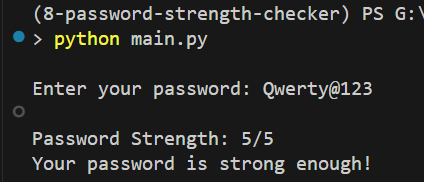

# 🔐 Password Strength Checker

A simple Python script that checks the strength of a password based on length, character variety, and use of special symbols.

---

## 📜 Features

- Evaluates password strength on a 5-point scale
- Checks for:
  - Minimum length (8 characters)
  - Uppercase letters
  - Lowercase letters
  - Numbers
  - Special characters
- Provides suggestions to improve weak passwords

---

## ▶️ How to Run

1. Make sure you have Python 3 installed.

2. Run the script from your terminal:

    ```bash
    python password_strength_checker.py
    ```

3. Enter a password when prompted, and the script will show your strength score and suggestions (if needed).

---

## 📋 Example Output

> Replace the image path below with your actual file or screenshot.



---

## 📦 Requirements

- Python 3.x  
(No external libraries are required except for the built-in `re` module.)

---

## 🧠 Logic Breakdown

The script checks for the following criteria:

| Criteria                          | Points |
|----------------------------------|--------|
| At least 8 characters            | 1      |
| At least one uppercase letter    | 1      |
| At least one lowercase letter    | 1      |
| At least one number              | 1      |
| At least one special character   | 1      |

Each satisfied condition adds 1 point to the strength score (max score: 5).

---

## 🛠️ Customization Ideas

- Enforce stronger rules (e.g., no common words)
- Integrate into a GUI or web form
- Save results to a file or log

---

## 👨‍💻 Author

Developed by [Osama bin Adnan]  
Feel free to fork, improve, and use it in your own projects!
