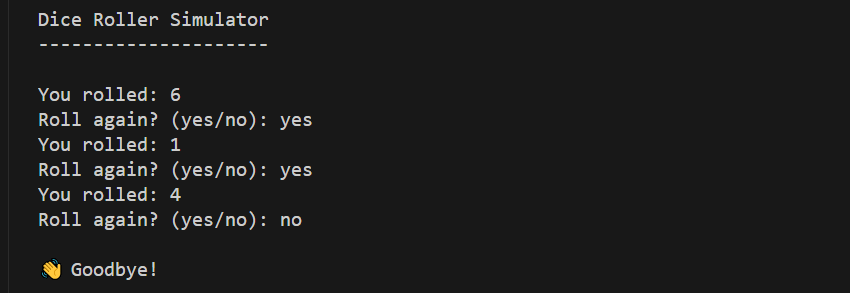

# 🎲 Dice Roller Simulator

A simple Python script that simulates rolling a six-sided dice. It keeps rolling until the user chooses to stop.

---

## 🚀 Features

- Simulates a standard 6-sided dice roll
- Repeats based on user input
- Fun and lightweight terminal-based interaction

---

## ▶️ How to Run

1. Make sure Python 3 is installed on your system.

2. Run the script in your terminal:

    ```bash
    main.py
    ```

3. The output will show a rolled number, and you'll be asked whether you'd like to roll again.

---

## 📸 Sample Output

> Replace the image path below with your screenshot or terminal output photo.



---

## 📦 Requirements

- Python 3.x
- No external libraries needed (uses built-in `random` module)

---

## 🧠 How It Works

- The `random.randint(1, 6)` function is used to simulate rolling a six-sided die.
- The program runs in a loop until the user types anything other than `yes`.
- Clean and minimal user interaction via terminal.

---


## 💡 Customization Ideas

- Add a roll counter
- Simulate dice with different numbers of sides (e.g., D20, D12)
- Include ASCII art for dice faces
- Create a GUI version using Tkinter or PyGame

---

## 👨‍💻 Author

Created with 🎲 and 🐍 by [Osama bin Adnan]  
Feel free to contribute or modify for your own fun projects!
